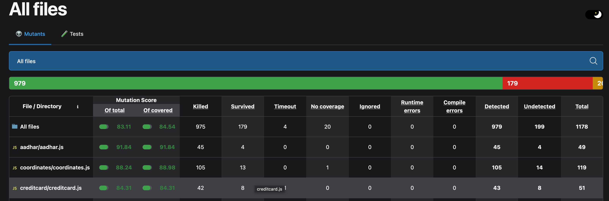

# Validator-Library
A modular JavaScript validator library providing common validators (email, phone, url, ip, username, password, date, credit card, Luhn, ISBN, UUID, time, coordinates, and more). Includes unit tests, integration tests, and mutation testing with Stryker.

## Status
- Unit tests: passing
- Integration tests: passing
- Mutation testing (Stryker): score ≥ 80%

## Install
Run:
git clone <your-repo-url>
cd Validator-Library
npm ci

## Usage
const validators = require('./index');

console.log(validators.email('alice@example.com'));
console.log(validators.phone('+919876543210'));

## Tests
npm run test:unit
npm run test:integration
npm test

## Mutation Testing
npx stryker run

Report at: reports/mutation/index.html

## License
MIT License
## Mutation Testing Score

Below is the mutation score report from Stryker:

